# Voclio AI Features - Complete Flow Documentation

> **Last Updated:** February 2026  
> **Version:** 1.0

This document provides a comprehensive overview of all AI-powered features in the Voclio application, including the models used, data flow, and integration points.

---

## Table of Contents

1. [Overview](#overview)
2. [AI Service Architecture](#ai-service-architecture)
3. [AI Providers & Models](#ai-providers--models)
4. [Feature Flows](#feature-flows)
   - [Voice-to-Task Workflow](#voice-to-task-workflow)
   - [Text Extraction](#text-extraction)
   - [Productivity Suggestions](#productivity-suggestions)
5. [API Endpoints](#api-endpoints)
6. [Configuration](#configuration)
7. [Error Handling](#error-handling)

---

## Overview

Voclio leverages AI to transform voice recordings into actionable tasks and notes. The core AI capabilities include:

| Feature                      | Description                             | Primary AI Provider |
| ---------------------------- | --------------------------------------- | ------------------- |
| **Audio Transcription**      | Convert voice recordings to text        | AssemblyAI          |
| **Task Extraction**          | Extract actionable tasks from text      | OpenRouter (GPT-4o) |
| **Note Extraction**          | Identify and extract notes/ideas        | OpenRouter (GPT-4o) |
| **Productivity Suggestions** | Generate personalized productivity tips | OpenRouter (GPT-4o) |
| **Text Summarization**       | Summarize long text content             | OpenRouter (GPT-4o) |

---

## AI Service Architecture

```mermaid
flowchart TD
    subgraph Client["📱 Mobile/Web Client"]
        Upload["Voice Recording Upload"]
    end

    subgraph Backend["🖥️ Voclio Backend"]
        VC["Voice Controller"]
        AIS["AI Service"]
        DB[(Database)]
    end

    subgraph Providers["☁️ AI Providers"]
        AAI["AssemblyAI<br/>Transcription + LeMUR"]
        OR["OpenRouter API<br/>GPT-4o"]
        GEM["Google Gemini<br/>2.0-flash (Fallback)"]
    end

    Upload --> VC
    VC --> AIS
    AIS --> AAI
    AIS --> OR
    AIS --> GEM
    VC --> DB
```



### Provider Priority

The AI Service uses a **fallback mechanism** based on available API keys:

```
1. OpenRouter (GPT-4o)     → Primary provider
2. Google Gemini 2.0-flash → Fallback if OpenRouter unavailable
3. AssemblyAI              → Dedicated for audio transcription & LeMUR
```

---

## AI Providers & Models

### 1. AssemblyAI

**Purpose:** Audio transcription and LeMUR (Language Model Understanding and Reasoning)

| Model/Feature          | Use Case             | Details                                          |
| ---------------------- | -------------------- | ------------------------------------------------ |
| **Core Transcription** | Speech-to-Text       | Supports Arabic (ar) and English (en)            |
| **LeMUR**              | Task/Note Extraction | Uses transcript IDs for context-aware extraction |

**Key Features:**

- Automatic punctuation
- Text formatting
- Language detection
- Asynchronous processing with polling

**API Endpoints Used:**

- `POST https://api.assemblyai.com/v2/upload` - Audio file upload
- `POST https://api.assemblyai.com/v2/transcript` - Request transcription
- `GET https://api.assemblyai.com/v2/transcript/{id}` - Poll status
- `POST https://api.assemblyai.com/lemur/v3/generate/task` - LeMUR tasks

---

### 2. OpenRouter (GPT-4o)

**Purpose:** Primary AI for text analysis, task extraction, and content generation

| Model           | Version | Use Cases                                                    |
| --------------- | ------- | ------------------------------------------------------------ |
| `openai/gpt-4o` | Latest  | Task extraction, Note extraction, Summarization, Suggestions |

**API Configuration:**

- **Endpoint:** `https://openrouter.ai/api/v1/chat/completions`
- **Temperature:** 0.2 (extraction) / 0.7 (summarization) / 0.8 (suggestions)
- **Max Tokens:** 3000-3500 (extraction) / 500-800 (others)

**Special Features:**

- **Arabic Dialect Support:** Egyptian, Saudi, Gulf, Levantine, Moroccan
- **Smart Date Parsing:** Converts relative dates (بكرة, الأسبوع الجاي) to ISO format
- **Priority Detection:** Infers task priority from context words
- **Subtask Extraction:** Detects lists and creates subtasks automatically

---

### 3. Google Gemini (Fallback)

**Purpose:** Backup provider when OpenRouter is unavailable

| Model              | Version | Status        |
| ------------------ | ------- | ------------- |
| `gemini-2.0-flash` | Latest  | Fallback only |

**Capabilities:**

- Text summarization
- Task extraction
- Note extraction
- Productivity suggestions

---

## Feature Flows

### Voice-to-Task Workflow

The main AI workflow converts voice recordings into tasks and notes.

#### One-Click Processing Flow


#### Step-by-Step Workflow

For mobile apps requiring user review before creation:


---

### Text Extraction

#### Task Extraction Prompt Structure

The AI uses a detailed Arabic-aware prompt for extraction:

```
📅 Current Date Information
📋 Task Structure Definition
🔍 Extraction Rules:
   ├── Task Detection Patterns
   ├── Priority Determination
   ├── Date Parsing (relative → absolute)
   └── Subtask Extraction
📝 Arabic Dialect Support
📄 Input Text
```

**Extracted Task JSON Structure:**

```json
{
  "title": "عنوان المهمة",
  "description": "وصف تفصيلي",
  "priority": "low | medium | high",
  "due_date": "YYYY-MM-DD or YYYY-MM-DDTHH:mm:ss or null",
  "subtasks": [{ "title": "مهمة فرعية 1" }, { "title": "مهمة فرعية 2" }]
}
```

#### Note Extraction

**Extracted Note JSON Structure:**

```json
{
  "title": "عنوان الملاحظة",
  "content": "محتوى الملاحظة الكامل",
  "tags": ["تاج1", "تاج2", "تاج3"]
}
```

---

### Productivity Suggestions

AI-powered productivity recommendations based on user data.

```mermaid
flowchart LR
    A[User Data<br/>Tasks, Notes, Habits] --> B[AI Service]
    B --> C[OpenRouter GPT-4o]
    C --> D["3-5 Actionable<br/>Suggestions"]
    D --> E[📱 Display to User]
```



**API:** `GET /productivity/suggestions`

---

## API Endpoints

### Voice Processing Endpoints

| Endpoint                      | Method | Description                                       |
| ----------------------------- | ------ | ------------------------------------------------- |
| `/voice/process-complete`     | POST   | One-click: Upload → Transcribe → Extract → Create |
| `/voice/upload`               | POST   | Upload audio file only                            |
| `/voice/transcribe`           | POST   | Transcribe a saved recording                      |
| `/voice/preview-extraction`   | POST   | Extract without creating (for review)             |
| `/voice/create-from-preview`  | POST   | Create items from previewed extraction            |
| `/voice/update-transcription` | PUT    | Edit transcription before extraction              |

### Productivity Endpoints

| Endpoint                    | Method | Description                             |
| --------------------------- | ------ | --------------------------------------- |
| `/productivity/suggestions` | GET    | Get AI-powered productivity suggestions |

---

## Configuration

### Environment Variables

```env
# AI Provider API Keys
OPENROUTER_API_KEY=sk-or-...      # Primary AI provider
GEMINI_API_KEY=AIza...            # Fallback provider
ASSEMBLYAI_API_KEY=...            # Audio transcription

# Upload Configuration
MAX_FILE_SIZE=50000000            # 50MB max audio file
```

### Supported Audio Formats

| Format | MIME Type  |
| ------ | ---------- |
| MP3    | audio/mpeg |
| WAV    | audio/wav  |
| M4A    | audio/m4a  |
| OGG    | audio/ogg  |
| WEBM   | audio/webm |

---

## Error Handling

### AI Service Errors

| Error Type                          | Cause                         | Resolution                         |
| ----------------------------------- | ----------------------------- | ---------------------------------- |
| `AssemblyAI API key not configured` | Missing API key               | Add `ASSEMBLYAI_API_KEY` to `.env` |
| `OpenRouter API error`              | API failure or quota exceeded | Check API key and billing          |
| `Transcription timeout`             | Audio >5 min processing       | Retry or split audio               |
| `No JSON array found`               | AI response parsing failed    | System retries with fallback       |

### Graceful Degradation

```mermaid
flowchart TD
    A[AI Request] --> B{OpenRouter Available?}
    B -->|Yes| C[Use GPT-4o]
    B -->|No| D{Gemini Available?}
    D -->|Yes| E[Use Gemini 2.0-flash]
    D -->|No| F{AssemblyAI LeMUR?}
    F -->|Yes| G[Use LeMUR]
    F -->|No| H[❌ Return Error]
```



---

## File Structure

```
src/
├── services/
│   └── ai.service.js          # Core AI service with all providers
├── controllers/
│   ├── voice.controller.js    # Voice recording & AI extraction
│   └── productivity.controller.js  # Productivity suggestions
├── routes/
│   ├── voice.routes.js        # Voice API routes
│   └── productivity.routes.js # Productivity API routes
└── models/
    └── voice.model.js         # Voice recording database model
```

---

## Summary

Voclio's AI system provides a seamless voice-to-productivity workflow:

1. **Speech-to-Text**: AssemblyAI handles multilingual transcription
2. **Smart Extraction**: GPT-4o with Arabic dialect awareness extracts tasks and notes
3. **Fallback Support**: Gemini 2.0-flash ensures reliability
4. **Flexible Workflows**: One-click or step-by-step processing options
5. **Productivity AI**: Personalized suggestions based on user patterns

---

_For questions or updates to this documentation, contact the development team._
